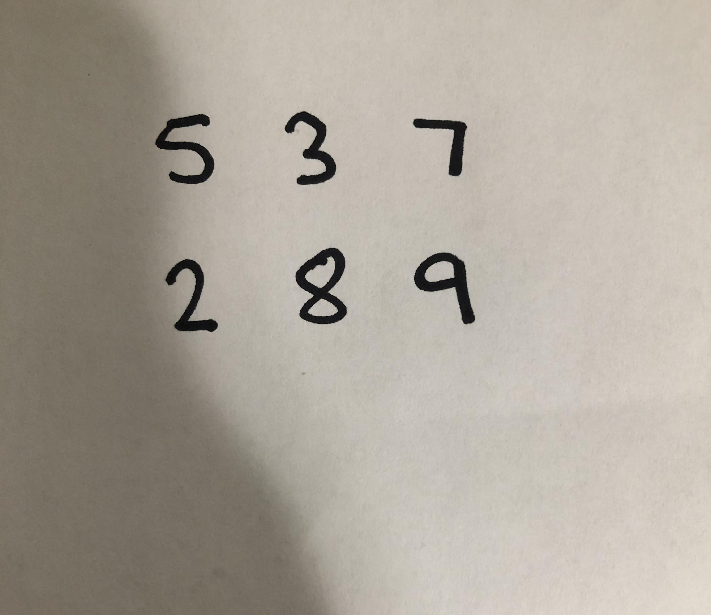

# Handwritten-Number-Guesser
This program uses the MNIST Digit data set to solve my problem. It allows user to input a picture of a set of digits and have the program guess the digits and perform subtraction and addition on them. The default is set to numbers on two lines, however it can be changed in the code. This project was inspired by my sister who needed a quick way to take a picture of her long list of data and perform subtraction. This uses openCV and a neural network model.

# Requirements
* Python 3.6 or below
* Keras
* Tensorflow
* Matplotlib
* Numpy
* Cv2

# Example

